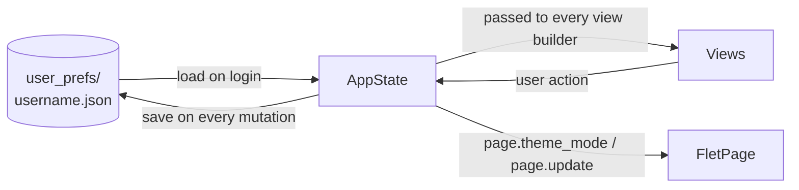
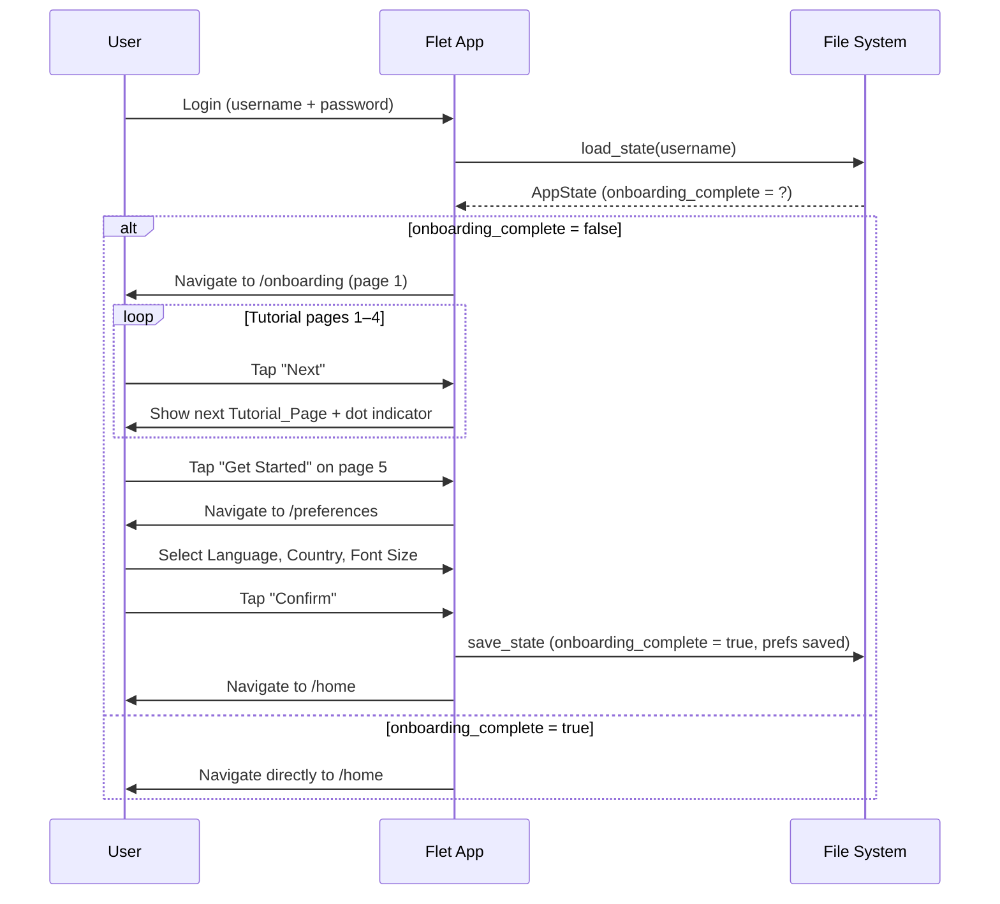

# Design Document: ASEAN Gov Chatbot UI

## Overview

This document describes the technical design for the UI redesign and onboarding flow of the ASEAN Gov Chatbot — a Flet (Python) application targeting elderly and less tech-savvy users. The redesign replaces the existing dark/neon aesthetic with a minimalistic iOS/Instagram-style theme (white background, black text), introduces a first-time onboarding tutorial, a preferences setup screen, and a persistent light/dark mode toggle.

The existing codebase is a single `main.py` using Flet 0.19.0 with route-based navigation (`page.go()`). This design extends that pattern while introducing a modular file structure, a local JSON persistence layer, and a global app state object.

**Key design decisions:**
- Keep Flet's route-based view stack as the navigation backbone — no third-party router needed.
- Store all user preferences and onboarding state in a per-user JSON file on disk (no database required for this data).
- Manage theme and font size through a single `AppState` object passed by reference into each view builder, so changes propagate immediately via `page.update()`.
- Refactor `main.py` into a package with one file per screen to keep each view maintainable.

---

## Architecture

### Module Structure

The app is refactored from a single `main.py` into a small package:

```
main.py                  # Entry point — calls ft.app(target=main)
app/
  __init__.py
  state.py               # AppState dataclass + load/save helpers
  router.py              # route_change handler, wires views to routes
  views/
    login.py             # /login route
    onboarding.py        # /onboarding route (tutorial pages 1–5)
    preferences.py       # /preferences route (language / country / font size)
    home.py              # /home route
    profile.py           # /profile route
  components/
    theme.py             # colour constants, font-size map, theme helpers
    controls.py          # reusable accessible button, list-tile, dot-indicator
```

### Navigation Flow

```mermaid
flowchart TD
    A[App Start] --> B[/login]
    B -->|New User — onboarding_complete = false| C[/onboarding]
    B -->|Returning User — onboarding_complete = true| E[/home]
    C -->|"Get Started" on page 5| D[/preferences]
    D -->|"Confirm" — all fields selected| E[/home]
    E -->|Profile icon| F[/profile]
    F -->|Back| E
    F -->|Logout| B
```

### State Flow



---

## Components and Interfaces

### AppState (`app/state.py`)

Central mutable state object. One instance lives for the lifetime of a `page` session.

```python
@dataclass
class AppState:
    username: str = ""
    language: str = "English"
    country: str = "Malaysia"
    font_size: str = "Medium"          # "Small" | "Medium" | "Large"
    theme_mode: str = "Light"          # "Light" | "Dark"
    onboarding_complete: bool = False

    # Derived helpers
    def font_sp(self) -> int:
        return {"Small": 14, "Medium": 16, "Large": 20}[self.font_size]

    def bg_color(self) -> str:
        return "#FFFFFF" if self.theme_mode == "Light" else "#121212"

    def text_color(self) -> str:
        return "#000000" if self.theme_mode == "Light" else "#FFFFFF"

    def surface_color(self) -> str:
        return "#F5F5F5" if self.theme_mode == "Light" else "#1E1E1E"
```

**Persistence functions:**

```python
PREFS_DIR = "user_prefs"

def load_state(username: str) -> AppState:
    """Load from user_prefs/{username}.json; return defaults if missing/corrupt."""

def save_state(state: AppState) -> None:
    """Atomically write state to user_prefs/{state.username}.json."""
```

`save_state` writes to a temp file then renames to avoid partial writes. If the directory or file does not exist it is created. If the file is corrupt (JSON decode error), `load_state` returns a fresh `AppState` with `onboarding_complete = False` (treating the user as new — Requirement 2.4).

### Theme Helpers (`app/components/theme.py`)

```python
ACCENT = "#4A90D9"          # muted blue — single accent colour (Req 1.2)
ACCENT_DARK = "#5BA3E8"     # slightly lighter for dark mode legibility

def apply_theme(page: ft.Page, state: AppState) -> None:
    """Set page.theme_mode and page.bgcolor, then call page.update()."""
```

Contrast ratios (verified against WCAG AA 4.5:1):
- Light mode: black `#000000` on white `#FFFFFF` → 21:1 ✓
- Dark mode: white `#FFFFFF` on `#121212` → 18.1:1 ✓
- Accent `#4A90D9` on white → 3.1:1 (accent used only for borders/icons, not body text) ✓

### Accessible Controls (`app/components/controls.py`)

```python
def primary_button(label: str, on_click, width=280, state: AppState = None) -> ft.ElevatedButton:
    """Min height 52px, min width 200px, accent bgcolor. (Req 1.3, 9.1)"""

def selection_tile(label: str, selected: bool, on_click, state: AppState) -> ft.Container:
    """48×48px min touch target, highlight when selected. (Req 9.1)"""

def dot_indicator(total: int, current: int, state: AppState) -> ft.Row:
    """Row of filled/unfilled circles indicating tutorial page position. (Req 3.5)"""
```

All tappable containers use `height >= 48, width >= 48` and `on_click` to satisfy the 48×48 touch target requirement (Req 9.1). No more than three interactive elements appear in a single row (Req 9.4).

### View Builders

Each view builder has the signature:

```python
def build_<screen>_view(page: ft.Page, state: AppState) -> ft.View:
    ...
```

The router calls the appropriate builder and appends the returned `ft.View` to `page.views`.

---

## Data Models

### User Preferences File

**Path:** `user_prefs/{username}.json`

```json
{
  "username": "alice",
  "language": "English",
  "country": "Malaysia",
  "font_size": "Medium",
  "theme_mode": "Light",
  "onboarding_complete": true
}
```

**Field constraints:**
| Field | Type | Allowed values |
|---|---|---|
| `username` | string | non-empty, alphanumeric |
| `language` | string | one of the 11 supported languages |
| `country` | string | one of the 11 ASEAN countries |
| `font_size` | string | `"Small"` \| `"Medium"` \| `"Large"` |
| `theme_mode` | string | `"Light"` \| `"Dark"` |
| `onboarding_complete` | boolean | `true` \| `false` |

**Supported languages (Req 4.2):** English, Bahasa Melayu, Bahasa Indonesia, Thai, Vietnamese, Filipino/Tagalog, Burmese, Khmer, Lao, Chinese (Simplified), Tamil.

**ASEAN countries (Req 5.2):** Malaysia, Indonesia, Thailand, Vietnam, Philippines, Myanmar, Cambodia, Laos, Singapore, Brunei, Timor-Leste.

### Onboarding State

Onboarding state is the `onboarding_complete` boolean within the same JSON file. No separate file is needed.

### Tutorial Page Data

Tutorial pages are defined as a static list of `TutorialPage` named tuples in `onboarding.py`:

```python
TutorialPage = namedtuple("TutorialPage", ["icon", "title", "description"])

TUTORIAL_PAGES = [
    TutorialPage(ft.icons.WAVING_HAND, "Welcome to ASEAN Gov Chat", "Ask questions about government services and documents in your language, simply and easily."),
    TutorialPage(ft.icons.QUESTION_ANSWER, "Ask About Government Documents", "Type your question and the app will find answers from official government sources for you."),
    TutorialPage(ft.icons.PUBLIC, "Choose Your Country", "Select your country so the app shows information relevant to your government and region."),
    TutorialPage(ft.icons.UPLOAD_FILE, "Upload or Link a Document", "Share a document or paste a website link to get a summary or ask questions about it."),
    TutorialPage(ft.icons.EXTENSION, "Browser Extension Available", "Install the browser extension to summarise any government web page and chat about it directly in your browser."),
]
```

Page 5 mentions the browser extension (Req 3.1) but no implementation is required for the extension itself.

---

## Onboarding Flow Sequence



---

## Screen Designs

### /login

- White background, centred column layout.
- Username + Password `ft.TextField` controls.
- Single "Login" / "Register" `primary_button`.
- On successful login: load `AppState`, check `onboarding_complete`, route accordingly.
- No country dropdown on signup (country is collected in Preferences_Setup instead).

### /onboarding

- Stateful view: tracks `current_page` index (0–4) in a local variable.
- Layout: icon (size 80), title (`Text`, bold, 20sp), description (`Text`, 16sp), dot indicator, navigation buttons.
- Back button hidden on page 0 (Req 3.6).
- "Next" on pages 0–3, "Get Started" on page 4 (Req 3.3, 3.4).
- Navigation is in-view (no route change per page) — `current_page` increments and `page.update()` re-renders.

### /preferences

- Three sequential steps rendered as a single scrollable column (or a stepped layout):
  1. Language selection — scrollable `Column` of `selection_tile` items.
  2. Country selection — scrollable `Column` of `selection_tile` items.
  3. Font size selection — row of three `selection_tile` items + live preview `Text`.
- "Confirm" button disabled until all three are selected (Req 7.1).
- On confirm: `save_state()`, then `page.go("/home")`.

### /home

- Retains existing chat functionality, restyled to white/black theme.
- AppBar uses `state.text_color()` and `state.bg_color()`.
- All text uses `state.font_sp()` for size.
- Profile icon in AppBar navigates to `/profile`.

### /profile

- Displays current Language, Country, Font_Size, Theme_Mode.
- Each preference has an edit control:
  - Language / Country: `ft.Dropdown` pre-populated with allowed values.
  - Font_Size: row of three `selection_tile` buttons.
  - Theme_Mode: `ft.Switch` (Light / Dark).
- On any change: update `AppState`, call `save_state()`, call `apply_theme()` or rebuild text sizes, call `page.update()` (Req 8.3–8.5, 10.5).

---

## Correctness Properties

*A property is a characteristic or behavior that should hold true across all valid executions of a system — essentially, a formal statement about what the system should do. Properties serve as the bridge between human-readable specifications and machine-verifiable correctness guarantees.*


### Property 1: Font Size Mapping Correctness

*For any* valid `font_size` value (`"Small"`, `"Medium"`, `"Large"`), `AppState.font_sp()` must return the exact sp value specified in the requirements (14, 16, 20 respectively), and all text elements rendered after an `AppState` update must use the value returned by `font_sp()`.

**Validates: Requirements 1.6, 1.7, 1.8, 1.9**

### Property 2: Preferences Persistence Round-Trip

*For any* `AppState` with valid field values, calling `save_state(state)` followed by `load_state(state.username)` must return an `AppState` that is field-for-field equal to the original, including `language`, `country`, `font_size`, `theme_mode`, and `onboarding_complete`.

**Validates: Requirements 2.1, 4.5, 5.5, 6.5, 7.2, 7.3, 8.3, 10.6**

### Property 3: Post-Login Routing Based on Onboarding State

*For any* `AppState`, the route selected after login must be `/onboarding` if and only if `onboarding_complete` is `False`; otherwise it must be `/home`. This must hold for all possible combinations of other preference fields.

**Validates: Requirements 2.2, 2.3**

### Property 4: Tutorial Navigation Button Visibility

*For any* tutorial page index `i` in the range `[0, len(TUTORIAL_PAGES) - 1]`, the "Back" button must be visible if and only if `i > 0`, and the "Next" button must be visible if and only if `i < len(TUTORIAL_PAGES) - 1`. On the last page, a "Get Started" button must be visible instead of "Next".

**Validates: Requirements 3.2, 3.3, 3.4, 3.6**

### Property 5: Tutorial Page Content Constraints

*For any* `TutorialPage` in `TUTORIAL_PAGES`, the title must contain no more than 8 words and the description must contain no more than 40 words, and the icon field must be non-None.

**Validates: Requirements 3.1, 3.7**

### Property 6: Dot Indicator Correctness

*For any* tutorial page index `i` and total page count `n`, `dot_indicator(n, i)` must return a row containing exactly `n` dots, where exactly one dot (at position `i`) is filled/highlighted and all others are unfilled.

**Validates: Requirements 3.5**

### Property 7: Confirm Button Enabled Only When All Preferences Selected

*For any* combination of selected language, country, and font size values in the Preferences_Setup, the "Confirm" button must be enabled if and only if all three fields have a non-None, non-empty value. If any one of the three is unset, the button must be disabled.

**Validates: Requirements 4.3, 5.3, 7.1**

### Property 8: Theme Colour Correctness

*For any* `AppState` with `theme_mode = "Light"`, `bg_color()` must return `"#FFFFFF"` and `text_color()` must return `"#000000"`. For `theme_mode = "Dark"`, `bg_color()` must return a dark colour (luminance < 0.1) and `text_color()` must return a light colour (luminance > 0.9). These values must update immediately when `theme_mode` is changed on the `AppState`.

**Validates: Requirements 8.5, 10.2, 10.3, 10.5**

### Property 9: Contrast Ratio Compliance

*For any* `theme_mode` value, the contrast ratio between `text_color()` and `bg_color()` as computed by the WCAG relative luminance formula must be at least 4.5:1.

**Validates: Requirements 9.2, 10.8**

### Property 10: Touch Target Minimum Size

*For any* tappable control produced by `primary_button()` or `selection_tile()`, the rendered height must be at least 48 logical pixels and the rendered width must be at least 48 logical pixels. Primary buttons must additionally have a minimum width of 200px and minimum height of 52px.

**Validates: Requirements 1.3, 9.1**

### Property 11: Profile Screen Reflects AppState

*For any* `AppState`, the profile view built by `build_profile_view(page, state)` must contain text or control values that match `state.language`, `state.country`, `state.font_size`, and `state.theme_mode`. After updating any preference field on the `AppState` and calling `page.update()`, the displayed values must reflect the new state without a restart.

**Validates: Requirements 8.1, 8.4**

---

## Error Handling

### Corrupt or Missing Preferences File (Req 2.4)

`load_state()` catches `FileNotFoundError` and `json.JSONDecodeError`. In both cases it returns a default `AppState` with `onboarding_complete = False`, treating the user as new. This is the safe fallback — the user will re-complete onboarding and re-set preferences rather than seeing a crash.

### Save Failure (Req 7.5)

`save_state()` wraps the write in a `try/except OSError`. On failure it raises a `PreferencesSaveError`. The preferences view catches this and renders an inline `ft.Text` error message in red, keeping the user on the preferences screen. Navigation to `/home` is only triggered after a successful save.

### Invalid Preference Values

`load_state()` validates each field against its allowed values after deserialisation. Any field with an unrecognised value is reset to its default (`"Medium"` for font size, `"Light"` for theme mode, `False` for onboarding state). This prevents crashes from manually edited JSON files.

### Login (Existing Logic)

Login validation is unchanged from the existing implementation. The design does not alter authentication logic.

---

## Testing Strategy

### Dual Testing Approach

Both unit tests and property-based tests are required. They are complementary:
- Unit tests cover specific examples, edge cases, and integration points.
- Property-based tests verify universal correctness across all valid inputs.

### Property-Based Testing

**Library:** `hypothesis` (Python) — well-maintained, integrates with `pytest`, supports custom strategies.

Install: `pip install hypothesis pytest`

Each property from the Correctness Properties section maps to exactly one property-based test. Tests are tagged with a comment referencing the design property.

**Minimum 100 iterations per property test** (Hypothesis default is 100; increase with `@settings(max_examples=200)` for critical properties).

Tag format in test files:
```python
# Feature: asean-gov-chatbot-ui, Property 2: Preferences persistence round-trip
```

**Example property test:**

```python
from hypothesis import given, settings, strategies as st
from app.state import AppState, save_state, load_state

LANGUAGES = ["English", "Bahasa Melayu", "Thai", "Vietnamese", "Filipino/Tagalog",
             "Burmese", "Khmer", "Lao", "Chinese (Simplified)", "Tamil", "Bahasa Indonesia"]
COUNTRIES = ["Malaysia", "Indonesia", "Thailand", "Vietnam", "Philippines",
             "Myanmar", "Cambodia", "Laos", "Singapore", "Brunei", "Timor-Leste"]

# Feature: asean-gov-chatbot-ui, Property 2: Preferences persistence round-trip
@given(
    username=st.text(min_size=1, max_size=20, alphabet=st.characters(whitelist_categories=("Lu", "Ll", "Nd"))),
    language=st.sampled_from(LANGUAGES),
    country=st.sampled_from(COUNTRIES),
    font_size=st.sampled_from(["Small", "Medium", "Large"]),
    theme_mode=st.sampled_from(["Light", "Dark"]),
    onboarding_complete=st.booleans(),
)
@settings(max_examples=200)
def test_preferences_round_trip(username, language, country, font_size, theme_mode, onboarding_complete):
    state = AppState(username=username, language=language, country=country,
                     font_size=font_size, theme_mode=theme_mode,
                     onboarding_complete=onboarding_complete)
    save_state(state)
    loaded = load_state(username)
    assert loaded == state
```

### Unit Tests

Unit tests focus on:
- Specific examples: default values (`font_size="Medium"`, `theme_mode="Light"`), exact sp mappings (14/16/20).
- Edge cases: corrupt JSON file returns safe defaults, missing file returns safe defaults, empty username handling.
- Integration: `save_state` then `load_state` with a real temp directory.
- Error conditions: `PreferencesSaveError` raised on write failure, inline error shown in preferences view.

**Example unit tests:**

```python
def test_font_sp_defaults():
    state = AppState()
    assert state.font_size == "Medium"
    assert state.font_sp() == 16

def test_font_sp_all_sizes():
    assert AppState(font_size="Small").font_sp() == 14
    assert AppState(font_size="Medium").font_sp() == 16
    assert AppState(font_size="Large").font_sp() == 20

def test_load_state_missing_file_returns_new_user():
    state = load_state("nonexistent_user_xyz")
    assert state.onboarding_complete == False

def test_load_state_corrupt_file_returns_new_user(tmp_path, monkeypatch):
    monkeypatch.setattr("app.state.PREFS_DIR", str(tmp_path))
    (tmp_path / "baduser.json").write_text("not valid json")
    state = load_state("baduser")
    assert state.onboarding_complete == False

def test_tutorial_pages_count():
    from app.views.onboarding import TUTORIAL_PAGES
    assert len(TUTORIAL_PAGES) >= 5

def test_tutorial_page_word_limits():
    from app.views.onboarding import TUTORIAL_PAGES
    for page in TUTORIAL_PAGES:
        assert len(page.title.split()) <= 8
        assert len(page.description.split()) <= 40
        assert page.icon is not None

def test_asean_countries_complete():
    from app.views.preferences import ASEAN_COUNTRIES
    required = {"Malaysia", "Indonesia", "Thailand", "Vietnam", "Philippines",
                "Myanmar", "Cambodia", "Laos", "Singapore", "Brunei", "Timor-Leste"}
    assert required.issubset(set(ASEAN_COUNTRIES))

def test_supported_languages_complete():
    from app.views.preferences import SUPPORTED_LANGUAGES
    required = {"English", "Bahasa Melayu", "Bahasa Indonesia", "Thai", "Vietnamese",
                "Filipino/Tagalog", "Burmese", "Khmer", "Lao", "Chinese (Simplified)", "Tamil"}
    assert required.issubset(set(SUPPORTED_LANGUAGES))
```

### Test File Layout

```
tests/
  test_state.py          # AppState, save_state, load_state (unit + property)
  test_theme.py          # bg_color, text_color, contrast ratio (unit + property)
  test_onboarding.py     # TUTORIAL_PAGES content, dot_indicator (unit + property)
  test_preferences.py    # confirm button logic, ASEAN lists (unit + property)
  test_routing.py        # post-login route selection (unit + property)
```

Run tests with:
```bash
pytest tests/ -v
```
