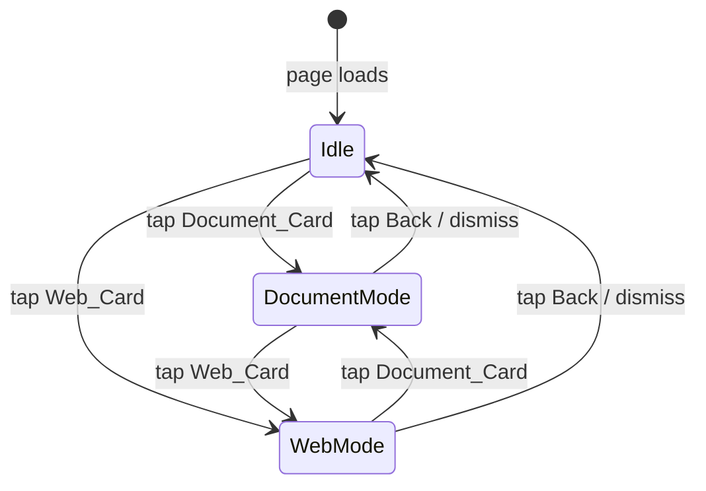

# Design Document: Home Dashboard UI

## Overview

This document describes the redesign of the `/home` screen in the ASEAN Gov Chat Flet application. The goal is to replace the current chat-list-centric layout with a sleek, mobile-first dashboard that follows **Progressive Disclosure**: two large Action Cards dominate the center of the screen; tapping one slides a Context Input Area up from below; a persistent Chat Bar anchors the bottom at all times.

The design extends the existing minimalist iOS aesthetic (stark white / dark slate, black/white accent tokens, rounded corners) established in the login screen and carried through `AppState` helpers and `app/components/theme.py`.

Key design decisions:
- **No new color tokens** — all colors come from `state.bg_color()`, `state.text_color()`, `state.surface_color()`, `ACCENT`, and `ACCENT_DARK`.
- **State-driven visibility** — a single `DashboardState` dataclass drives which panels are shown, making theme refresh straightforward.
- **Flet `AnimatedSwitcher` / `offset` animation** — used for the slide-up of the Context Input Area.
- **`ft.FilePicker`** — Flet's built-in overlay for file selection (drag-and-drop on desktop, native picker on mobile).

---

## Architecture

The redesigned home view is a single function `build_home_view(page, state)` that returns an `ft.View`. Internally it is structured as three logical layers stacked in a `ft.Column` that fills the viewport:

```
┌─────────────────────────────────┐
│  AppBar (title + profile icon)  │  ← unchanged from current impl
├─────────────────────────────────┤
│                                 │
│   Content Area (expand=True)    │  ← greeting + Action Cards
│                                 │
├─────────────────────────────────┤
│  Context Input Area (animated)  │  ← slides up when a card is active
├─────────────────────────────────┤
│  Chat Bar (always visible)      │  ← fixed at bottom
└─────────────────────────────────┘
```

State transitions are driven by a mutable `active_mode` variable (`None | "document" | "web"`) and a set of helper functions that mutate controls and call `page.update()`.



---

## Components and Interfaces

### 1. `build_home_view(page, state) -> ft.View`

Entry point. Assembles all sub-components and wires event handlers.

**Parameters**
- `page: ft.Page` — the Flet page (needed for `page.update()`, `page.overlay`, speech API)
- `state: AppState` — provides theme helpers and font size

**Returns** `ft.View` with `route="/home"`.

---

### 2. Action Cards

Two `ft.Container` instances built by a factory function:

```python
def action_card(title: str, icon, mode: str) -> ft.Container
```

- `width`: fills half the row minus spacing (responsive via `ft.Row` with `expand=True` children)
- `height`: minimum 140 px (Requirement 7.1)
- `border_radius`: 20 (Requirement 1.2)
- `border`: `ft.border.all(2, accent)` — Accent_Color border (Requirement 1.2)
- `shadow`: `ft.BoxShadow(blur_radius=12, color=ft.colors.with_opacity(0.08, "#000000"))` (Requirement 1.5)
- `on_click`: calls `set_mode(mode)`
- Active state: `bgcolor` switches from `surface_color()` to a tinted variant using `ft.colors.with_opacity(0.12, accent)` (Requirement 3.4)

---

### 3. Context Input Area

A `ft.AnimatedSwitcher`-wrapped `ft.Container` that is hidden (`height=0`, `opacity=0`) when `active_mode is None` and fully visible otherwise.

Contains two sub-panels, only one visible at a time:

**Document Panel**
- `ft.Container` styled as a dashed drop zone (Requirement 4.1)
- `ft.FilePicker` registered in `page.overlay` for file selection
- Selected file name display + clear button (Requirement 4.2)
- Accepted extensions: `.pdf`, `.docx`, `.png`, `.jpg`, `.jpeg` (Requirement 4.3)
- Inline error `ft.Text` for unsupported formats (Requirement 4.4)
- "Analyze" `ft.ElevatedButton` enabled only when a valid file is selected (Requirement 4.5)

**Web Panel**
- `ft.TextField` with placeholder "Paste a government website URL" (Requirement 5.1)
- `on_change` validator: checks `value.startswith(("http://", "https://"))` (Requirement 5.2)
- Inline error `ft.Text` below the field (Requirement 5.3)
- "Extract" `ft.ElevatedButton` enabled only when URL is valid (Requirement 5.4)
- `ft.ProgressRing` shown during extraction (Requirement 5.5)

**Shared controls**
- "← Back" `ft.TextButton` that calls `set_mode(None)` (Requirement 3.5)

---

### 4. Chat Bar

A `ft.Container` fixed at the bottom:

```
┌──────────────────────────────────────────┐
│  [ text field (expand) ]  [ mic button ] │
└──────────────────────────────────────────┘
```

- `border_radius`: 20 (Requirement 2.6)
- `bgcolor`: `state.surface_color()` (Requirement 2.5)
- `border`: `ft.border.all(2, accent)` (Requirement 2.5)
- Text field: `min_height=52` (Requirement 7.2), `expand=True`
- Mic button: `ft.IconButton` with `icon=ft.icons.MIC_ROUNDED`, `width=48`, `height=48` (Requirement 7.3)
- On submit: appends message to chat history, triggers AI response (Requirement 2.7)

---

### 5. Speech Input

Flet does not ship a built-in speech-to-text widget. The implementation uses `page.invoke_method` / platform channel or a JS bridge depending on deployment target. For the initial implementation:

- On mobile (Android/iOS via Flet packaging): use `ft.Audio` + platform-specific STT via `page.run_task` with a Python `speech_recognition` call.
- On web: use the Web Speech API via `page.eval_js`.
- Mic button `on_click` → `start_speech_input()` which sets a pulsing visual indicator on the Chat Bar border (Requirement 8.2) and begins recording.
- On result: populate `chat_field.value`, call `page.update()` (Requirement 8.3).
- On permission denied: show inline `ft.SnackBar` (Requirement 8.4).

---

### 6. Greeting Header

A `ft.Text` above the Action Cards:

```python
ft.Text("How can I help you today?", size=state.font_sp() + 8, weight=ft.FontWeight.BOLD)
```

Satisfies Requirement 1.6.

---

## Data Models

No new persistent data models are introduced. All UI state is ephemeral and held in local Python variables / closures within `build_home_view`.

```python
# Ephemeral UI state (mutable via closures)
active_mode: str | None = None   # None | "document" | "web"
selected_file: str | None = None # file path or name after picker
url_valid: bool = False           # True when URL passes validation
is_recording: bool = False        # True while STT is active
```

The `AppState` dataclass (from `app/state.py`) is read-only within this view — theme and font changes are applied by the router rebuilding the view on navigation.

---


## Correctness Properties

*A property is a characteristic or behavior that should hold true across all valid executions of a system — essentially, a formal statement about what the system should do. Properties serve as the bridge between human-readable specifications and machine-verifiable correctness guarantees.*

### Property 1: Action Cards always present with correct structure

*For any* `AppState` (any theme mode, font size, language), calling `build_home_view` should return a view whose control tree contains exactly two action card containers, each with `border_radius=20`, an Accent_Color border, a minimum height of 140 px, a minimum width of 140 px, and a non-empty text label.

**Validates: Requirements 1.1, 1.2, 1.3, 7.1, 7.5**

---

### Property 2: Theme mode determines background and surface colors

*For any* `AppState`, the view's `bgcolor` should equal `state.bg_color()`, the Chat Bar's `bgcolor` should equal `state.surface_color()`, and switching `theme_mode` between `"Light"` and `"Dark"` should produce the corresponding color values (`#FFFFFF` / `#121212` for background, `#F5F5F5` / `#1E1E1E` for surface).

**Validates: Requirements 1.4, 6.1, 6.2**

---

### Property 3: Font size applied consistently

*For any* `AppState` with `font_size` in `{"Small", "Medium", "Large"}`, all `ft.Text` elements in the view should use a `size` value derived from `state.font_sp()` (i.e. 14, 16, or 20 respectively).

**Validates: Requirements 6.3**

---

### Property 4: Chat Bar always present regardless of active mode

*For any* value of `active_mode` (`None`, `"document"`, `"web"`), the Chat Bar container should be present and visible in the view's control tree.

**Validates: Requirements 2.1**

---

### Property 5: Tapping an Action Card reveals the correct Context Input panel

*For any* mode in `{"document", "web"}`, invoking the card's `on_click` handler should make the corresponding panel (file drop zone for `"document"`, URL field for `"web"`) visible, and the other panel invisible.

**Validates: Requirements 3.1, 3.2**

---

### Property 6: Action Cards remain visible while Context Input Area is active

*For any* `active_mode` in `{"document", "web"}`, both Action Card containers should remain present and visible in the control tree (not hidden or removed).

**Validates: Requirements 3.6**

---

### Property 7: Switching active card changes the Context Input panel

*For any* transition from one active mode to the other (`"document"` → `"web"` or `"web"` → `"document"`), the Context Input Area should display the panel corresponding to the newly active card, and the previously active panel should become invisible.

**Validates: Requirements 3.7**

---

### Property 8: File format validation is consistent

*For any* file extension string, the validation function should return `True` if and only if the extension (case-insensitive) is in `{".pdf", ".docx", ".png", ".jpg", ".jpeg"}`. For any invalid extension, the inline error text should be visible and the Analyze button should be disabled.

**Validates: Requirements 4.3, 4.4, 4.5**

---

### Property 9: URL validation and submit button state are consistent

*For any* string entered in the URL field, the URL is valid if and only if it starts with `"http://"` or `"https://"`. The inline error text should be visible if and only if the field is non-empty and the URL is invalid. The Extract button should be enabled if and only if the URL is valid.

**Validates: Requirements 5.2, 5.3, 5.4**

---

### Property 10: Chat submission grows the chat history

*For any* non-empty message string submitted via the Chat Bar, the chat list should contain one more item after submission than before, and the new item should reflect the submitted message.

**Validates: Requirements 2.7**

---

### Property 11: Speech transcription populates the Chat Bar field

*For any* non-empty transcription string produced by the speech input handler, the Chat Bar text field's `value` should equal that transcription string, and the field should remain editable (not read-only).

**Validates: Requirements 8.3, 8.5**

---

### Property 12: Mic button activates recording state

*For any* initial state where `is_recording=False`, invoking the mic button's `on_click` handler should set `is_recording=True` and apply a visual indicator to the Chat Bar.

**Validates: Requirements 2.4, 8.2**

---

## Error Handling

| Scenario | Handling |
|---|---|
| Unsupported file format selected | Inline `ft.Text` error below drop zone; Analyze button stays disabled |
| Invalid URL entered | Inline `ft.Text` error below URL field; Extract button stays disabled |
| Microphone permission denied | `ft.SnackBar` with explanation message; mic button returns to idle state |
| Empty chat message submitted | Submission silently ignored; no chat item added |
| File picker cancelled (no file chosen) | UI returns to empty drop zone state; no error shown |
| Network/extraction error on URL submit | `ft.SnackBar` with error message; loading indicator hidden |

All error messages use `state.text_color()` for text and are placed inline near the offending control to minimize disruption to the layout.

---

## Testing Strategy

### Dual Testing Approach

Both unit tests and property-based tests are required. They are complementary:
- **Unit tests** cover specific examples, structural checks, and edge cases.
- **Property tests** verify universal invariants across many generated inputs.

### Unit Tests (specific examples and structural checks)

- `test_appbar_structure` — view has AppBar with `center_title=True` and a profile `IconButton` in actions (Req 1.7)
- `test_greeting_text_present` — view control tree contains a greeting `ft.Text` above the cards (Req 1.6)
- `test_action_card_icons` — Document Card uses `UPLOAD_FILE_OUTLINED`, Web Card uses `LANGUAGE_OUTLINED` (Req 1.3)
- `test_chat_bar_mic_icon` — Chat Bar row ends with an `IconButton` using `MIC_ROUNDED` (Req 2.3)
- `test_chat_bar_text_field_present` — Chat Bar contains a `TextField` (Req 2.2)
- `test_chat_bar_border_radius` — Chat Bar container has `border_radius=20` (Req 2.6)
- `test_chat_bar_min_height` — Chat Bar `TextField` has `min_height >= 52` (Req 7.2)
- `test_mic_button_touch_target` — mic `IconButton` has `width=48, height=48` (Req 7.3)
- `test_document_panel_label` — document panel contains text "Drop a file here, or tap to browse" (Req 4.1)
- `test_url_field_placeholder` — URL field has placeholder "Paste a government website URL" (Req 5.1)
- `test_loading_indicator_on_submit` — after valid URL submit, `ft.ProgressRing` is visible (Req 5.5)
- `test_back_button_present` — Context Input Area contains a back/dismiss control (Req 3.5)
- `test_recording_visual_indicator` — when `is_recording=True`, Chat Bar border or color changes (Req 8.2)
- `test_permission_denied_message` — calling the permission-denied handler shows a `SnackBar` (Req 8.4)

### Property-Based Tests

Use **Hypothesis** (Python property-based testing library).

Each property test runs a minimum of **100 iterations**.

Tag format: `# Feature: home-dashboard-ui, Property {N}: {property_text}`

```python
# Feature: home-dashboard-ui, Property 1: Action Cards always present with correct structure
@given(st.sampled_from(["Light", "Dark"]), st.sampled_from(["Small", "Medium", "Large"]))
@settings(max_examples=100)
def test_action_cards_structure(theme_mode, font_size): ...

# Feature: home-dashboard-ui, Property 2: Theme mode determines background and surface colors
@given(st.sampled_from(["Light", "Dark"]))
@settings(max_examples=100)
def test_theme_colors(theme_mode): ...

# Feature: home-dashboard-ui, Property 3: Font size applied consistently
@given(st.sampled_from(["Small", "Medium", "Large"]))
@settings(max_examples=100)
def test_font_size_consistency(font_size): ...

# Feature: home-dashboard-ui, Property 4: Chat Bar always present regardless of active mode
@given(st.sampled_from([None, "document", "web"]))
@settings(max_examples=100)
def test_chat_bar_always_present(active_mode): ...

# Feature: home-dashboard-ui, Property 5: Tapping an Action Card reveals the correct Context Input panel
@given(st.sampled_from(["document", "web"]))
@settings(max_examples=100)
def test_card_tap_reveals_correct_panel(mode): ...

# Feature: home-dashboard-ui, Property 6: Action Cards remain visible while Context Input Area is active
@given(st.sampled_from(["document", "web"]))
@settings(max_examples=100)
def test_cards_remain_visible_in_active_mode(active_mode): ...

# Feature: home-dashboard-ui, Property 7: Switching active card changes the Context Input panel
@given(st.sampled_from([("document", "web"), ("web", "document")]))
@settings(max_examples=100)
def test_mode_switch_changes_panel(mode_transition): ...

# Feature: home-dashboard-ui, Property 8: File format validation is consistent
@given(st.text(min_size=1, max_size=10))
@settings(max_examples=200)
def test_file_format_validation(extension): ...

# Feature: home-dashboard-ui, Property 9: URL validation and submit button state are consistent
@given(st.text(min_size=0, max_size=200))
@settings(max_examples=200)
def test_url_validation_consistency(url_string): ...

# Feature: home-dashboard-ui, Property 10: Chat submission grows the chat history
@given(st.text(min_size=1, max_size=500))
@settings(max_examples=100)
def test_chat_submission_grows_history(message): ...

# Feature: home-dashboard-ui, Property 11: Speech transcription populates the Chat Bar field
@given(st.text(min_size=1, max_size=500))
@settings(max_examples=100)
def test_transcription_populates_field(transcription): ...

# Feature: home-dashboard-ui, Property 12: Mic button activates recording state
@given(st.sampled_from(["Light", "Dark"]))
@settings(max_examples=100)
def test_mic_activates_recording(theme_mode): ...
```

### Test File Location

`tests/views/test_home_dashboard.py`
