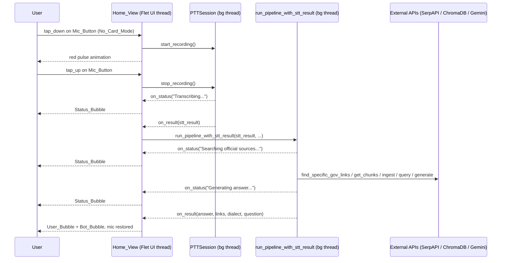

# Design Document: Microphone Speech Integration

## Overview

This feature wires `engine/speech/main.py`'s full speech pipeline into the microphone button
on `app/views/home.py`. The integration is conditional: when no action card is active
(`active_mode[0] is None`), pressing the mic button records audio via `PTTSession`, then
hands the STT result to a new `run_pipeline_with_stt_result` entry point that runs the
government-search pipeline on a background thread and streams status/result/error events
back to the UI via callbacks. When a card is active the existing behaviour is unchanged.

Two existing classes/modules require modification:

1. `PTTSession` in `engine/speech/speech_to_text.py` — add `on_result`, `on_error`, and
   `on_status` constructor parameters and fire them at the right points.
2. `engine/speech/main.py` — add `run_pipeline_with_stt_result` as a clean, importable
   entry point that accepts an STT result dict and three callbacks.

`app/views/home.py` already contains most of the wiring (the `_run_main_pipeline`,
`_on_stt_result`, `_on_stt_error`, `_on_stt_status`, and `_get_ptt_session` helpers are
present but reference a `_pipeline_with_result` name that does not yet exist and a
`PTTSession` constructor that does not yet accept callbacks). The home view changes are
therefore minimal: fix the `PTTSession` instantiation and the conditional branch in
`_start_recording` / `_stop_recording`.

---

## Architecture



The UI thread never blocks. All heavy work (ASR, LLM, web scraping, ChromaDB, Gemini) runs
on daemon background threads. Callbacks cross the thread boundary; `page.update()` is called
inside each callback wrapper in `home.py` (Flet 0.19.0 makes `page.update()` thread-safe).

---

## Components and Interfaces

### 1. `PTTSession` (modified — `engine/speech/speech_to_text.py`)

**Constructor signature change:**

```python
class PTTSession:
    def __init__(
        self,
        on_result: Callable[[dict], None] | None = None,
        on_error:  Callable[[Exception], None] | None = None,
        on_status: Callable[[str], None] | None = None,
    ): ...
```

**Callback firing points:**

| Event | Callback | Payload |
|---|---|---|
| Transcription starts | `on_status` | `"Transcribing audio..."` |
| LLM normalisation starts | `on_status` | `"Normalising query..."` |
| Processing complete | `on_result` | `{"dialect": str, "question": str, "query": str}` |
| Any unhandled exception | `on_error` | the `Exception` instance |

All callbacks are invoked from the background processing thread. The UI layer is responsible
for marshalling updates to the Flet UI thread (via `page.update()`).

---

### 2. `run_pipeline_with_stt_result` (new — `engine/speech/main.py`)

```python
def run_pipeline_with_stt_result(
    stt_result:    dict,
    on_status:     Callable[[str], None],
    on_result:     Callable[[str, list, str, str], None],
    on_error:      Callable[[Exception], None],
    country_suffix: str = "my",
) -> None:
    """
    Runs the full speech pipeline synchronously (intended to be called from a
    background thread).  Fires on_status before each major step, on_result on
    success, on_error on failure.  Never raises.
    """
```

**Step sequence and status messages:**

| Step | `on_status` message |
|---|---|
| Government link discovery | `"Searching official sources..."` |
| Web chunk extraction | `"Extracting web content..."` |
| ChromaDB ingestion | `"Indexing content..."` |
| Semantic query | `"Finding relevant information..."` |
| LLM response generation | `"Generating answer..."` |

On success: `on_result(answer, links, dialect, question)` — exactly once.  
On any exception: `on_error(exc)` — exactly once; `on_result` is NOT called.

The `country_suffix` parameter replaces the module-level `country_suffix = "my"` constant
so callers can pass the appropriate country code.

---

### 3. `build_home_view` (modified — `app/views/home.py`)

**Changes required:**

1. `_get_ptt_session()` — pass `on_result`, `on_error`, `on_status` to `PTTSession(...)`.
2. `_start_recording()` — add conditional branch: only call `_get_ptt_session().start_recording()`
   when `active_mode[0] is None`; otherwise fall through to existing card-mode behaviour.
3. `_run_main_pipeline()` — replace the reference to the non-existent `_pipeline_with_result`
   with a direct call to `run_pipeline_with_stt_result` (already imported in the function).
4. `_on_stt_result()` — keep as-is; it already calls `_run_main_pipeline`.
5. `_add_bubble_safe()` / `_ui()` — no changes needed; already thread-safe for Flet 0.19.0.

**Mic button state machine:**

```
DEFAULT ──tap_down (no card, no text)──► RECORDING
RECORDING ──tap_up──► PROCESSING  (pipeline running)
PROCESSING ──on_result / on_error──► DEFAULT
DEFAULT ──tap_down (has text)──► (submit text, stay DEFAULT)
DEFAULT ──tap_down (card active)──► RECORDING (existing card flow)
```

---

## Data Models

### STT_Result dict

```python
{
    "dialect":  str,   # e.g. "Manglish", "Singlish+English"
    "question": str,   # Standard English question
    "query":    str,   # Search-optimised keywords
}
```

Produced by `PTTSession.process_audio()` and consumed by `run_pipeline_with_stt_result`.

### Pipeline result (passed to `on_result`)

| Parameter | Type | Description |
|---|---|---|
| `answer` | `str` | LLM-generated response text |
| `links` | `list[str]` | Government URLs that were scraped |
| `dialect` | `str` | Dialect from STT_Result |
| `question` | `str` | English question from STT_Result |

### Bubble roles

| Role | Alignment | Style |
|---|---|---|
| `"user"` | Right | Accent background, white/dark text |
| `"bot"` | Left | Surface background, bordered |
| `"status"` | Centre | Italic, semi-transparent pill |


---

## Correctness Properties

*A property is a characteristic or behavior that should hold true across all valid executions of a system — essentially, a formal statement about what the system should do. Properties serve as the bridge between human-readable specifications and machine-verifiable correctness guarantees.*

### Property 1: No-card mode starts recording

*For any* home view state where `active_mode[0]` is `None` and the chat field is empty, a
`tap_down` event on the mic button must set `is_recording[0]` to `True` and change
`mic_circle.bgcolor` to `ft.colors.RED_400`.

**Validates: Requirements 1.1**

---

### Property 2: Card mode never invokes the pipeline

*For any* home view state where `active_mode[0]` is `"document"` or `"web"`, a complete
tap-down / tap-up cycle on the mic button must not call `run_pipeline_with_stt_result`.

**Validates: Requirements 1.2, 6.1, 6.2**

---

### Property 3: Text-present tap submits text, not recording

*For any* non-empty string in `chat_field.value`, a tap on the mic button must call
`on_chat_submit` and must not call `PTTSession.start_recording`, regardless of
`active_mode[0]`.

**Validates: Requirements 1.3, 6.3**

---

### Property 4: STT result is forwarded to the pipeline

*For any* STT_Result dict produced by `PTTSession`, the `_on_stt_result` callback in
`home.py` must call `run_pipeline_with_stt_result` with that exact dict when
`active_mode[0]` is `None`.

**Validates: Requirements 2.1**

---

### Property 5: Pipeline steps execute in order

*For any* valid STT_Result dict, `run_pipeline_with_stt_result` must call
`find_specific_gov_links`, then `get_chunks_from_list`, then `ingest_to_chroma`, then
`query_from_chroma`, then `generate_final_response` — in that order, with no step skipped
when the previous step returns a non-empty result.

**Validates: Requirements 2.2**

---

### Property 6: `on_status` fires before each major step

*For any* valid STT_Result dict, `run_pipeline_with_stt_result` must invoke `on_status`
at least once before each of the five pipeline steps begins, so that the caller always
receives a progress message prior to any blocking I/O.

**Validates: Requirements 2.3, 3.2**

---

### Property 7: `on_result` fires exactly once on success

*For any* STT_Result dict that produces a successful pipeline run, `on_result` must be
called exactly once with a non-empty `answer` string, a list of `links`, the original
`dialect`, and the original `question`. `on_error` must not be called.

**Validates: Requirements 3.3, 2.4**

---

### Property 8: `on_error` fires exactly once on failure; `on_result` is not called

*For any* STT_Result dict where any pipeline step raises an exception, `on_error` must be
called exactly once with that exception, and `on_result` must not be called.

**Validates: Requirements 3.4, 2.5**

---

### Property 9: `country_suffix` is passed through to link discovery

*For any* `country_suffix` string passed to `run_pipeline_with_stt_result`,
`find_specific_gov_links` must be called with that exact `country_suffix` value.

**Validates: Requirements 3.5**

---

### Property 10: PTTSession `on_result` round-trip

*For any* audio buffer that produces a non-empty transcription, `PTTSession.process_audio`
must call `on_result` with a dict containing non-`None` values for `dialect`, `question`,
and `query`.

**Validates: Requirements 4.2**

---

### Property 11: PTTSession `on_error` on failure

*For any* exception raised inside `PTTSession.process_audio`, `on_error` must be called
with that exception and `on_result` must not be called.

**Validates: Requirements 4.3**

---

### Property 12: PTTSession `on_status` fires during processing

*For any* audio buffer that triggers `process_audio`, `on_status` must be called at least
once before `on_result` or `on_error` is called.

**Validates: Requirements 4.4**

---

### Property 13: `_add_bubble_safe` grows the chat list

*For any* text string and role, calling `_add_bubble_safe(text, role)` must increase
`len(chat_list.controls)` by exactly one.

**Validates: Requirements 5.1**

---

### Property 14: `is_recording` stays `True` during pipeline execution

*For any* pipeline run initiated from No_Card_Mode, `is_recording[0]` must remain `True`
from the moment `_on_stt_result` is called until either `on_result` or `on_error` is
received.

**Validates: Requirements 5.2**

---

### Property 15: Mic button restored after terminal callback

*For any* pipeline run, after either `on_result` or `on_error` is received,
`is_recording[0]` must be `False` and `mic_circle.bgcolor` must equal `accent`.

**Validates: Requirements 5.3**

---

### Property 16: Mode switch updates routing correctly

*For any* sequence of `set_mode` calls, `active_mode[0]` must always equal the last
non-toggle mode argument passed, and a subsequent mic tap must route to the pipeline if
and only if `active_mode[0]` is `None`.

**Validates: Requirements 6.4**

---

## Error Handling

| Failure point | Handler | User-visible effect |
|---|---|---|
| `PTTSession` — no audio captured | `on_error` | Status bubble: "⚠️ No audio captured" |
| `PTTSession` — ASR model error | `on_error` | Status bubble with exception message |
| `find_specific_gov_links` returns empty list | Early return in pipeline, `on_error` | Status bubble: "⚠️ No official sources found" |
| `get_chunks_from_list` returns empty list | Early return in pipeline, `on_error` | Status bubble: "⚠️ Could not extract web content" |
| `ingest_to_chroma` / `query_from_chroma` exception | `on_error` | Status bubble with exception message |
| `generate_final_response` exception | `on_error` | Status bubble with exception message |
| Any unhandled exception in pipeline | `on_error` | Status bubble: "⚠️ {exc}" |

In all error cases `on_result` is never called, and the mic button is restored to its
default state by the `on_error` handler in `home.py`.

---

## Testing Strategy

### Dual Testing Approach

Both unit tests and property-based tests are required. Unit tests cover specific examples,
integration points, and edge cases. Property tests verify universal invariants across
randomly generated inputs.

### Property-Based Testing Library

Use **Hypothesis** (Python) for all property-based tests.

```
pip install hypothesis
```

Each property test must run a minimum of **100 iterations** (Hypothesis default is 100;
increase with `@settings(max_examples=200)` for critical paths).

Each test must be tagged with a comment in the format:

```python
# Feature: microphone-speech-integration, Property N: <property_text>
```

### Unit Tests

Focus on:
- `PTTSession` constructor accepts callback kwargs without error (Req 4.1)
- `run_pipeline_with_stt_result` is importable and has the correct signature (Req 3.1)
- `_add_bubble` creates the correct widget type for each role (`"user"`, `"bot"`, `"status"`)
- `is_valid_url` and `is_valid_extension` edge cases (empty string, mixed case)
- `set_mode` toggle: calling `set_mode("document")` twice resets to `None`

### Property Tests

One property-based test per correctness property (P1–P16). Each test:
- Uses `@given(...)` with appropriate Hypothesis strategies
- Mocks external I/O (SerpAPI, ChromaDB, Gemini, sounddevice) to keep tests fast
- Asserts the universally quantified statement from the property definition

Example skeleton:

```python
from hypothesis import given, settings, strategies as st

# Feature: microphone-speech-integration, Property 7: on_result fires exactly once on success
@given(
    dialect=st.text(min_size=1),
    question=st.text(min_size=1),
    query=st.text(min_size=1),
    country_suffix=st.sampled_from(["my", "sg", "th", "ph"]),
)
@settings(max_examples=100)
def test_on_result_fires_exactly_once_on_success(dialect, question, query, country_suffix):
    stt_result = {"dialect": dialect, "question": question, "query": query}
    result_calls = []
    error_calls = []

    with patch("engine.speech.main.find_specific_gov_links", return_value=["https://gov.example"]), \
         patch("engine.speech.main.get_chunks_from_list", return_value=["chunk"]), \
         patch("engine.speech.main.ingest_to_chroma"), \
         patch("engine.speech.main.query_from_chroma", return_value=["info"]), \
         patch("engine.speech.main.generate_final_response", return_value="answer"):
        run_pipeline_with_stt_result(
            stt_result,
            on_status=lambda _: None,
            on_result=lambda a, l, d, q: result_calls.append((a, l, d, q)),
            on_error=lambda e: error_calls.append(e),
            country_suffix=country_suffix,
        )

    assert len(result_calls) == 1
    assert len(error_calls) == 0
    assert result_calls[0][2] == dialect
    assert result_calls[0][3] == question
```
