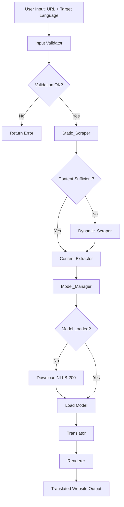

# Design Document: Web Scraping Translation System

## Overview

The Web Scraping Translation System is a Python-based application that extracts text content from websites, translates it using local machine learning models, and reconstructs the website with translated content. The system intelligently selects between static HTML parsing and dynamic JavaScript rendering based on content availability, ensuring compatibility with both traditional and modern web applications.

The architecture follows a pipeline pattern with five core components:
1. **Static_Scraper**: Fast extraction using BeautifulSoup + Requests for static HTML
2. **Dynamic_Scraper**: Playwright-based extraction for JavaScript-rendered content
3. **Model_Manager**: Handles NLLB-200 model downloading, loading, and caching
4. **Translator**: Performs batch translation using the NLLB-200 model
5. **Renderer**: Reconstructs the website with translated text while preserving structure

The system prioritizes performance by attempting static scraping first, falling back to dynamic scraping only when necessary. Translation occurs locally using the NLLB-200 distilled 600M parameter model, eliminating API costs and ensuring privacy.

## Architecture

### High-Level Architecture



### Component Interaction Flow

1. **Input Phase**: User provides URL and target language → Input Validator checks format and language support
2. **Scraping Phase**: Static_Scraper attempts extraction → If insufficient content detected, Dynamic_Scraper takes over
3. **Model Phase**: Model_Manager ensures NLLB-200 is downloaded and loaded into memory
4. **Translation Phase**: Translator processes extracted text in batches using the loaded model
5. **Rendering Phase**: Renderer reconstructs the website with translated text, preserving original structure

### Technology Stack

- **Python 3.8+**: Core language
- **BeautifulSoup4**: HTML parsing for static content
- **Requests**: HTTP client for static scraping
- **Playwright**: Browser automation for dynamic content
- **Transformers (HuggingFace)**: NLLB-200 model interface
- **PyTorch**: Model execution backend

## Components and Interfaces

### 1. Input Validator

**Responsibility**: Validates user input before processing begins

**Interface**:
```python
class InputValidator:
    def validate_url(self, url: str) -> ValidationResult:
        """Validates URL format and accessibility"""
        pass
    
    def validate_language(self, language_code: str) -> ValidationResult:
        """Validates target language is supported by NLLB-200"""
        pass
    
    def get_supported_languages(self) -> List[str]:
        """Returns list of supported language codes"""
        pass
```

**Key Methods**:
- `validate_url()`: Uses regex to check URL format, returns error if malformed
- `validate_language()`: Checks against NLLB-200 supported language list
- `get_supported_languages()`: Returns comprehensive list for error messages

**Error Handling**: Returns structured ValidationResult with success flag and error message

### 2. Static_Scraper

**Responsibility**: Extracts text content from static HTML websites using BeautifulSoup

**Interface**:
```python
class StaticScraper:
    def __init__(self, timeout: int = 10):
        self.timeout = timeout
        self.session = requests.Session()
    
    def scrape(self, url: str) -> ScrapedContent:
        """Fetches and parses static HTML content"""
        pass
    
    def extract_text_elements(self, soup: BeautifulSoup) -> List[TextElement]:
        """Extracts text from HTML elements with structure preservation"""
        pass
    
    def is_content_sufficient(self, content: ScrapedContent) -> bool:
        """Determines if extracted content is adequate"""
        pass
```

**Key Methods**:
- `scrape()`: Fetches HTML using Requests with 10-second timeout
- `extract_text_elements()`: Traverses DOM tree, extracts text from p, h1-h6, li, td, th, div, span
- `is_content_sufficient()`: Checks if extracted text exceeds minimum threshold (e.g., 100 characters)

**Structure Preservation**: Each TextElement stores:
- Original text content
- Element type (tag name)
- XPath or CSS selector for positioning
- Parent-child relationships

### 3. Dynamic_Scraper

**Responsibility**: Extracts text content from JavaScript-rendered websites using Playwright

**Interface**:
```python
class DynamicScraper:
    def __init__(self, timeout: int = 30):
        self.timeout = timeout
        self.browser = None
    
    async def scrape(self, url: str) -> ScrapedContent:
        """Launches browser, waits for rendering, extracts content"""
        pass
    
    async def wait_for_content(self, page: Page) -> None:
        """Waits for page to fully render"""
        pass
    
    def extract_text_elements(self, page: Page) -> List[TextElement]:
        """Extracts text from rendered DOM"""
        pass
    
    async def cleanup(self) -> None:
        """Closes browser session"""
        pass
```

**Key Methods**:
- `scrape()`: Launches headless Chromium, navigates to URL, waits for network idle
- `wait_for_content()`: Uses Playwright's `wait_for_load_state('networkidle')` with 30-second timeout
- `extract_text_elements()`: Queries rendered DOM for text content with structure
- `cleanup()`: Ensures browser process terminates

**Rendering Strategy**: Waits for network idle state to ensure JavaScript execution completes

### 4. Model_Manager

**Responsibility**: Downloads, loads, and caches the NLLB-200 translation model

**Interface**:
```python
class ModelManager:
    def __init__(self, model_name: str = "facebook/nllb-200-distilled-600M"):
        self.model_name = model_name
        self.model = None
        self.tokenizer = None
        self.cache_dir = Path.home() / ".cache" / "web-scraping-translation"
    
    def is_model_available(self) -> bool:
        """Checks if model exists locally"""
        pass
    
    def download_model(self) -> None:
        """Downloads NLLB-200 from HuggingFace"""
        pass
    
    def load_model(self) -> Tuple[AutoModelForSeq2SeqLM, AutoTokenizer]:
        """Loads model and tokenizer into memory"""
        pass
    
    def get_model(self) -> Tuple[AutoModelForSeq2SeqLM, AutoTokenizer]:
        """Returns cached model or loads if not available"""
        pass
```

**Key Methods**:
- `is_model_available()`: Checks cache directory for model files
- `download_model()`: Uses HuggingFace `from_pretrained()` with cache_dir parameter
- `load_model()`: Loads model and tokenizer, moves to GPU if available
- `get_model()`: Singleton pattern - returns cached instance or loads on first call

**Caching Strategy**: Model remains in memory for the application lifetime, avoiding repeated loading overhead

**Model Selection**: Uses `facebook/nllb-200-distilled-600M` (600M parameters) for balance between quality and performance

### 5. Translator

**Responsibility**: Translates extracted text using the NLLB-200 model

**Interface**:
```python
class Translator:
    def __init__(self, model_manager: ModelManager):
        self.model_manager = model_manager
        self.model = None
        self.tokenizer = None
        self.max_length = 512
        self.batch_size = 8
    
    def initialize(self) -> None:
        """Loads model from ModelManager"""
        pass
    
    def translate_batch(self, texts: List[str], target_lang: str) -> List[str]:
        """Translates multiple texts in a single batch"""
        pass
    
    def translate_elements(self, elements: List[TextElement], target_lang: str) -> List[TextElement]:
        """Translates all text elements, preserving structure"""
        pass
    
    def get_language_code(self, language: str) -> str:
        """Converts language name to NLLB-200 language code"""
        pass
```

**Key Methods**:
- `initialize()`: Retrieves model and tokenizer from Model_Manager
- `translate_batch()`: Tokenizes input, runs model inference, decodes output
- `translate_elements()`: Batches TextElements, translates, updates with translated text
- `get_language_code()`: Maps user-friendly language names to NLLB codes (e.g., "Spanish" → "spa_Latn")

**Batching Strategy**: 
- Groups text elements into batches of 8 for efficient GPU utilization
- Splits texts exceeding 512 tokens into chunks
- Preserves formatting markers (line breaks, whitespace) during translation

**Error Handling**: If translation fails for an element, retains original text and logs error

### 6. Renderer

**Responsibility**: Reconstructs the website with translated text

**Interface**:
```python
class Renderer:
    def render(self, original_html: str, translated_elements: List[TextElement]) -> str:
        """Reconstructs HTML with translated text"""
        pass
    
    def replace_text_content(self, soup: BeautifulSoup, elements: List[TextElement]) -> None:
        """Updates DOM with translated text"""
        pass
    
    def preserve_structure(self, soup: BeautifulSoup) -> None:
        """Ensures layout and styling remain intact"""
        pass
    
    def to_html(self, soup: BeautifulSoup) -> str:
        """Serializes BeautifulSoup object to HTML string"""
        pass
```

**Key Methods**:
- `render()`: Parses original HTML, replaces text content, returns modified HTML
- `replace_text_content()`: Uses XPath/CSS selectors to locate elements and update text
- `preserve_structure()`: Maintains all attributes, classes, styles, and non-text elements
- `to_html()`: Converts BeautifulSoup object to valid HTML string

**Preservation Strategy**:
- All CSS classes and inline styles remain unchanged
- Images, videos, and interactive elements (buttons, forms) preserved
- Internal links maintained (external links may need adjustment)
- JavaScript code blocks left untouched

## Data Models

### ValidationResult

```python
@dataclass
class ValidationResult:
    success: bool
    error_message: Optional[str] = None
    data: Optional[Any] = None
```

**Purpose**: Standardized return type for validation operations

### TextElement

```python
@dataclass
class TextElement:
    text: str
    element_type: str  # HTML tag name
    selector: str  # XPath or CSS selector
    parent_selector: Optional[str] = None
    attributes: Dict[str, str] = field(default_factory=dict)
    translated_text: Optional[str] = None
```

**Purpose**: Represents a single text-containing HTML element with structure information

**Fields**:
- `text`: Original text content
- `element_type`: HTML tag (e.g., "p", "h1", "li")
- `selector`: Unique identifier for element location in DOM
- `parent_selector`: Parent element selector for hierarchy preservation
- `attributes`: Element attributes (class, id, style, etc.)
- `translated_text`: Translated content (populated by Translator)

### ScrapedContent

```python
@dataclass
class ScrapedContent:
    url: str
    html: str
    text_elements: List[TextElement]
    metadata: Dict[str, Any]
    scraping_method: str  # "static" or "dynamic"
    timestamp: datetime
```

**Purpose**: Container for all extracted content and metadata

**Fields**:
- `url`: Source URL
- `html`: Original HTML content
- `text_elements`: List of extracted TextElement objects
- `metadata`: Additional info (title, language, encoding, etc.)
- `scraping_method`: Which scraper was used
- `timestamp`: When scraping occurred

### TranslationRequest

```python
@dataclass
class TranslationRequest:
    url: str
    target_language: str
    timeout: int = 120
    force_dynamic: bool = False
```

**Purpose**: User input encapsulation

**Fields**:
- `url`: Website URL to translate
- `target_language`: Target language code or name
- `timeout`: Maximum processing time in seconds
- `force_dynamic`: Skip static scraping, use Playwright directly

### TranslationResult

```python
@dataclass
class TranslationResult:
    success: bool
    translated_html: Optional[str] = None
    original_url: str = ""
    target_language: str = ""
    error_message: Optional[str] = None
    processing_time: float = 0.0
    scraping_method: str = ""
```

**Purpose**: System output encapsulation

**Fields**:
- `success`: Whether translation completed successfully
- `translated_html`: Reconstructed HTML with translated text
- `original_url`: Source URL
- `target_language`: Target language used
- `error_message`: Error details if success=False
- `processing_time`: Total execution time
- `scraping_method`: Which scraper was used

## API Design

### Main Entry Point

```python
class WebScrapingTranslator:
    def __init__(self):
        self.validator = InputValidator()
        self.static_scraper = StaticScraper()
        self.dynamic_scraper = DynamicScraper()
        self.model_manager = ModelManager()
        self.translator = Translator(self.model_manager)
        self.renderer = Renderer()
    
    def translate_website(self, request: TranslationRequest) -> TranslationResult:
        """Main API method for translating websites"""
        pass
```

### Translation Pipeline

```python
def translate_website(self, request: TranslationRequest) -> TranslationResult:
    start_time = time.time()
    
    # Step 1: Validate input
    url_validation = self.validator.validate_url(request.url)
    if not url_validation.success:
        return TranslationResult(success=False, error_message=url_validation.error_message)
    
    lang_validation = self.validator.validate_language(request.target_language)
    if not lang_validation.success:
        return TranslationResult(success=False, error_message=lang_validation.error_message)
    
    # Step 2: Scrape content
    scraped_content = self._scrape_with_fallback(request.url, request.force_dynamic)
    if scraped_content is None:
        return TranslationResult(success=False, error_message="Failed to scrape content")
    
    # Step 3: Initialize translator
    self.translator.initialize()
    
    # Step 4: Translate content
    translated_elements = self.translator.translate_elements(
        scraped_content.text_elements,
        request.target_language
    )
    
    # Step 5: Render translated website
    translated_html = self.renderer.render(scraped_content.html, translated_elements)
    
    processing_time = time.time() - start_time
    
    return TranslationResult(
        success=True,
        translated_html=translated_html,
        original_url=request.url,
        target_language=request.target_language,
        processing_time=processing_time,
        scraping_method=scraped_content.scraping_method
    )
```

### Scraping Strategy Selection Algorithm

```python
def _scrape_with_fallback(self, url: str, force_dynamic: bool) -> Optional[ScrapedContent]:
    """Implements intelligent fallback from static to dynamic scraping"""
    
    if force_dynamic:
        return self.dynamic_scraper.scrape(url)
    
    # Attempt static scraping first
    try:
        static_content = self.static_scraper.scrape(url)
        
        # Check if content is sufficient
        if self.static_scraper.is_content_sufficient(static_content):
            return static_content
        
        # Insufficient content - fallback to dynamic
        logger.info(f"Static scraping returned insufficient content for {url}, trying dynamic scraping")
        return self.dynamic_scraper.scrape(url)
    
    except Exception as e:
        logger.warning(f"Static scraping failed for {url}: {e}, trying dynamic scraping")
        return self.dynamic_scraper.scrape(url)
```

**Algorithm Logic**:
1. If `force_dynamic=True`, skip static scraping
2. Otherwise, attempt static scraping with BeautifulSoup
3. Check content sufficiency using heuristic (minimum character count, element count)
4. If insufficient or error occurs, fallback to Playwright-based dynamic scraping
5. Return ScrapedContent with method indicator

**Sufficiency Heuristic**:
- Minimum 100 characters of extracted text
- At least 5 text elements found
- No indication of JavaScript-required content (e.g., "Please enable JavaScript" messages)

## Algorithms

### Content Extraction Algorithm

```python
def extract_text_elements(self, soup: BeautifulSoup) -> List[TextElement]:
    """Extracts text from HTML while preserving structure"""
    elements = []
    text_tags = ['p', 'h1', 'h2', 'h3', 'h4', 'h5', 'h6', 'li', 'td', 'th', 'span', 'div', 'a']
    
    for tag in soup.find_all(text_tags):
        # Skip empty elements
        text = tag.get_text(strip=True)
        if not text:
            continue
        
        # Skip script and style tags
        if tag.name in ['script', 'style']:
            continue
        
        # Generate unique selector
        selector = self._generate_selector(tag)
        parent_selector = self._generate_selector(tag.parent) if tag.parent else None
        
        # Extract attributes
        attributes = dict(tag.attrs)
        
        element = TextElement(
            text=text,
            element_type=tag.name,
            selector=selector,
            parent_selector=parent_selector,
            attributes=attributes
        )
        elements.append(element)
    
    return elements
```

**Key Features**:
- Targets common text-containing tags
- Skips empty elements and script/style tags
- Generates unique CSS selectors for each element
- Preserves parent-child relationships
- Captures element attributes for reconstruction

### Batch Translation Algorithm

```python
def translate_elements(self, elements: List[TextElement], target_lang: str) -> List[TextElement]:
    """Translates text elements in batches"""
    target_code = self.get_language_code(target_lang)
    
    # Group elements into batches
    batches = [elements[i:i + self.batch_size] for i in range(0, len(elements), self.batch_size)]
    
    for batch in batches:
        texts = [elem.text for elem in batch]
        
        try:
            # Translate batch
            translated_texts = self.translate_batch(texts, target_code)
            
            # Update elements with translations
            for elem, translated in zip(batch, translated_texts):
                elem.translated_text = translated
        
        except Exception as e:
            logger.error(f"Translation failed for batch: {e}")
            # Keep original text for failed elements
            for elem in batch:
                elem.translated_text = elem.text
    
    return elements
```

**Optimization Strategy**:
- Batches of 8 texts for GPU efficiency
- Parallel processing within batches
- Graceful degradation (keeps original text on failure)
- Preserves element order

### Content Reconstruction Algorithm

```python
def render(self, original_html: str, translated_elements: List[TextElement]) -> str:
    """Reconstructs HTML with translated text"""
    soup = BeautifulSoup(original_html, 'html.parser')
    
    # Create selector-to-translation mapping
    translation_map = {elem.selector: elem.translated_text for elem in translated_elements}
    
    # Update text content
    for selector, translated_text in translation_map.items():
        try:
            element = soup.select_one(selector)
            if element:
                # Replace text while preserving child elements
                if element.string:
                    element.string.replace_with(translated_text)
                else:
                    # Element has children - update text nodes only
                    for content in element.contents:
                        if isinstance(content, str):
                            content.replace_with(translated_text)
                            break
        except Exception as e:
            logger.warning(f"Failed to update element {selector}: {e}")
    
    return str(soup)
```

**Preservation Strategy**:
- Uses CSS selectors to locate exact elements
- Updates text content without affecting structure
- Preserves child elements (nested tags)
- Maintains all attributes and styling
- Gracefully handles missing elements

